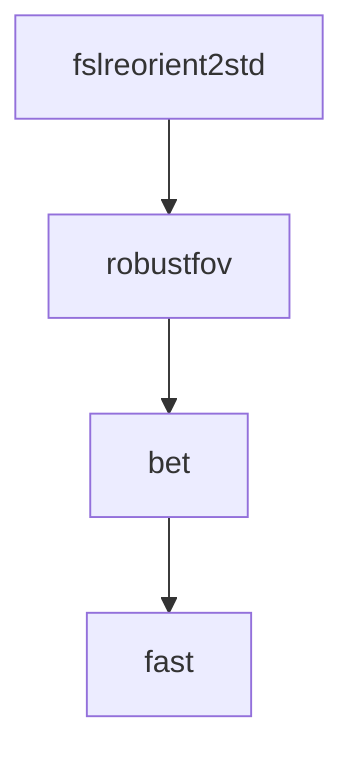

# Example: Generate mermaid graph

This example takes the previous example (anatomical preprocessing) and shows how the `GraphRunner` can be used to reconstruct an execution graph to then generate a mermaid graph.

> [!NOTE]  
> The `GraphRunner` is still in development and not ready for wide-spread use. At this point this example serves more as a tech-demo.

```Python
{{#include pysrc/mermaid.py}}
```
[Full source.](pysrc/mermaid.py)

