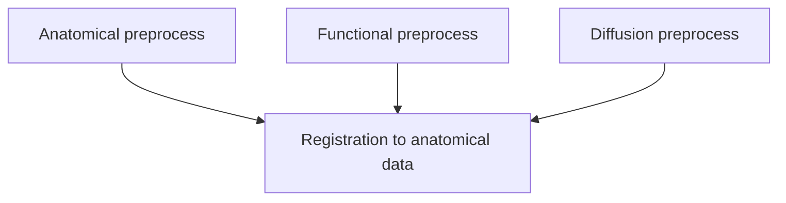

# Example: Workflow engines

NiWrap turns command-line tools into typed functions that return objects, so they slot naturally into workflow engines. Instead of writing shell scripts or manually tracking intermediate files, you can express neuroimaging pipelines in code and let the engine handle scheduling, caching, and provenance.

A common pattern is to decompose your pipeline into linear branches, where each branch becomes a single script or node in the workflow engine. Inside that node, you use NiWrap to perform a series of operations. The engine handles scheduling and dependencies between branches, while NiWrap handles the detailed command-line work within each branch.

For example, a neuroimaging workflow might preprocess three input modalities in parallel and then register them to the anatomical image:



In pseudocode, each branch is a node that internally runs a sequence of preprocessing steps:

```python
function anatomical_preprocess(t1w):
    # Anatomical preprocessing

function functional_preprocess(bold):
    # Functional preprocessing

function diffusion_preprocess(dwi):
    # Diffusion preprocessing

function registration_to_anatomical(anat, func, dwi):
    # Register functional and diffusion to anatomical space
```

The [`niwrap-workflow-examples`](https://github.com/styx-api/niwrap-workflow-examples) repository demonstrates the same minimal pipeline using the NiWrap Python interface with several workflow engines:

1. **BET** — skull-strip the T1w image with FSL.
2. **N4 bias-field correction** — correct intensity inhomogeneity with ANTs.
3. **Template registration** — register the preprocessed T1w to `MNI152NLin2009cAsym` with ANTs.

The concrete examples below apply this same pattern with different workflow engines. Each engine expresses branches and dependencies in its own syntax, but the underlying structure is the same: the engine manages orchestration, while NiWrap translates Python calls into the underlying neuroimaging command-line tools.

## Examples

| Engine | Description | Example |
| --- | --- | --- |
| [Dagster](https://dagster.io/) | Orchestration platform with ops, jobs, and a web UI | [`examples/dagster-niwrap`](https://github.com/styx-api/niwrap-workflow-examples/tree/main/examples/dagster-niwrap) |
| [Snakemake](https://snakemake.github.io/) | Workflow management system for reproducible analyses | [`examples/snakemake-niwrap`](https://github.com/styx-api/niwrap-workflow-examples/tree/main/examples/snakemake-niwrap) |
| [Snakebids](https://snakebids.readthedocs.io/) | BIDS-aware workflows built on Snakemake | [`examples/snakebids-niwrap`](https://github.com/styx-api/niwrap-workflow-examples/tree/main/examples/snakebids-niwrap) |
| [Nextflow](https://www.nextflow.io/) | DSL for data-driven computational pipelines | [`examples/nextflow-niwrap`](https://github.com/styx-api/niwrap-workflow-examples/tree/main/examples/nextflow-niwrap) |

See the repository's [README](https://github.com/styx-api/niwrap-workflow-examples#readme) for setup and run instructions.
